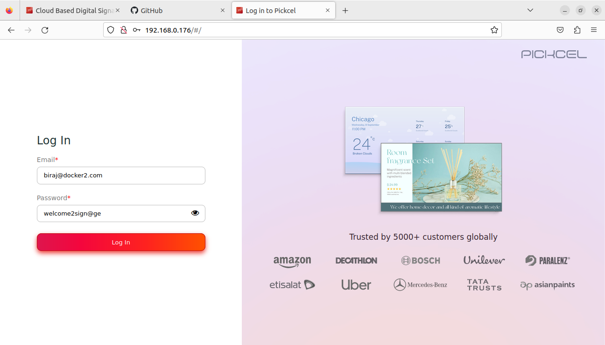
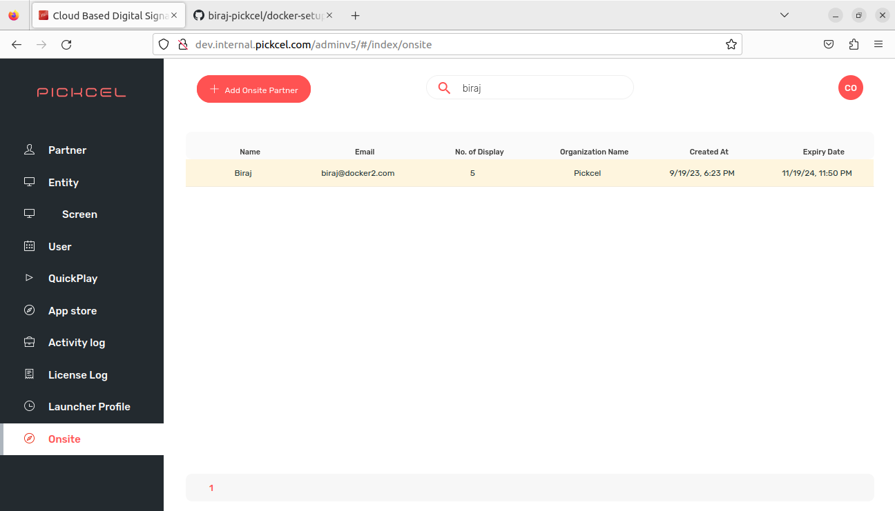
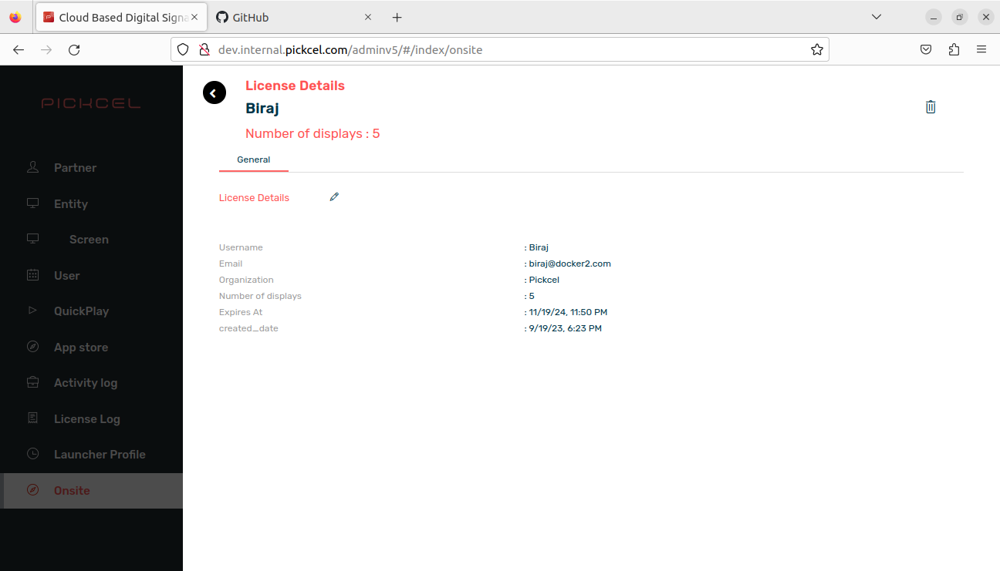
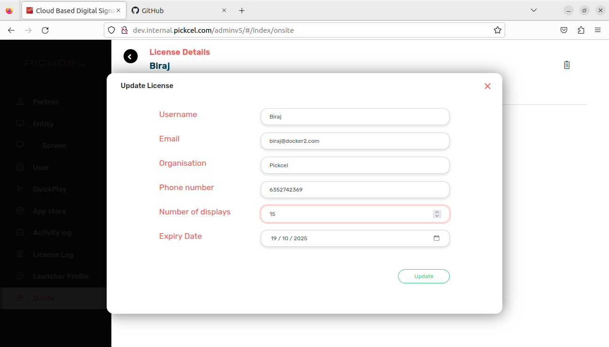
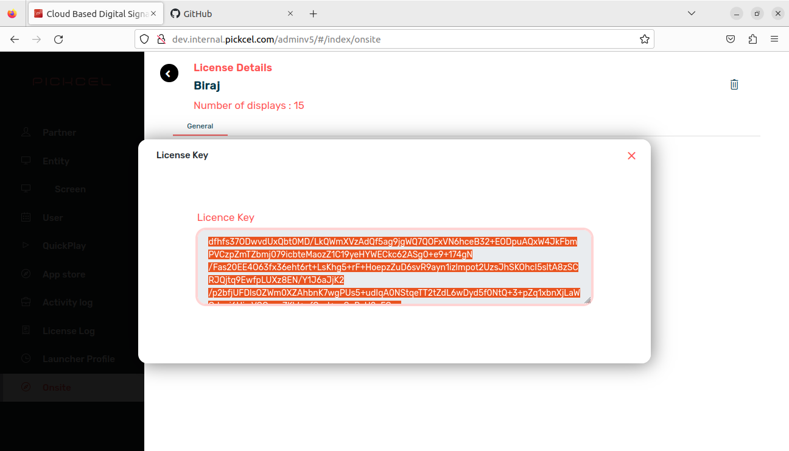
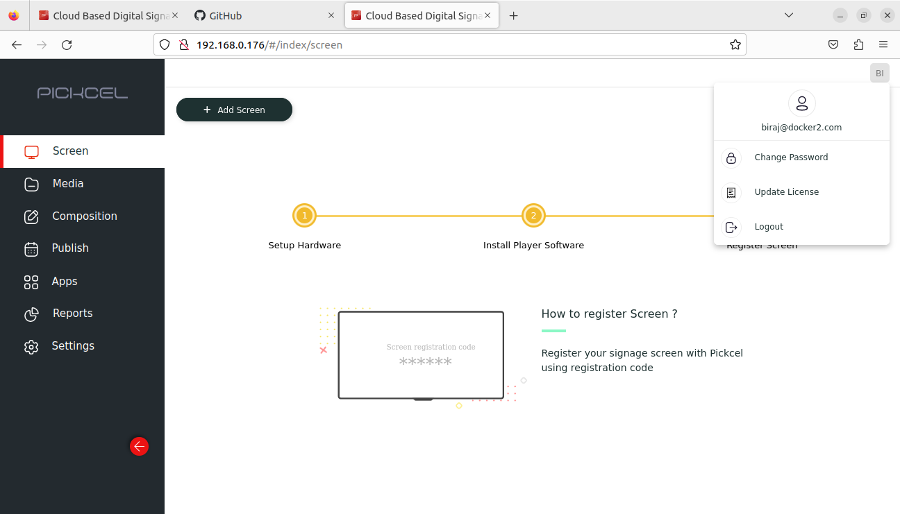
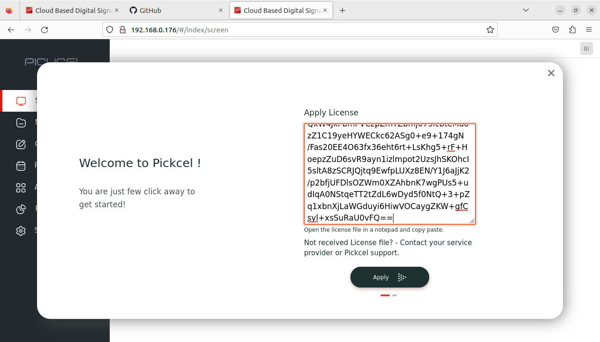
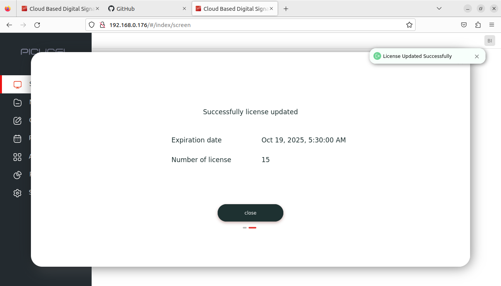

# Docker on-premise initial setup guide

1. You can do the setup now with a script, which has automated most of the post-installation steps required in docker setup!
2. Tested on Ubuntu 20.04.
3. You need to have an internet connection for the installation steps. Once the setup is complete, you can run the software without internet as well.

## Steps:

**Note: You need to have an internet connection for the installation steps.**

- Install `curl` & `ifconfig` (for knowing the IP address of your network in case you don't know it already.)

  ```
  sudo apt-get install curl net-tools
  ```

- Make sure that Node.js & Docker are installed.

  ```
  node --version
  ```

  ```
  docker --version
  ```

  If they are installed, these commands would list the versions without any errors.

- To install node.js,

  1. Install [node version manager (nvm)](https://github.com/nvm-sh/nvm#installing-and-updating)
     ```
     curl -o- https://raw.githubusercontent.com/nvm-sh/nvm/v0.39.3/install.sh | bash
     ```
  2. Verify if `nvm` is properly installed or not using
     ```
     nvm --version
     ```
  3. Then install Node.js (version 18) using
     ```
     nvm install 18
     ```
  4. To pick up the `nvm` command
     ```
     source ~/.bashrc
     ```

- To install Docker, go to their [installation page](https://docs.docker.com/engine/install/#server), choose your operating system from the list & follow the instructions.

- If you installed Docker in the previous step, then you will have to wait for a minute or so before proceeding further for Docker socket to be running.

  To verify if Docker socket is running, execute the following command. If the socket is running, it won't throw any error.

  ```
  sudo docker images
  ```

- To know your network's IP address, you can run the `ifconfig` command & note down the required IP address. It will be required in a later step.

- Using `cd` command, navigate & go inside the _docker-pickcelv3_ folder.

- By this point, Node & Docker should be installed & IP address have been should be noted down. These are the prerequisites for the next step.

- Run the setup command.

  1. Go inside the _setup_ folder.

     ```
     cd ./setup
     ```

  2. Install the dependencies.

     ```
     npm install
     ```

  3. Run the setup command.
     ```
     npm run docker-setup
     ```

- The script will ask for IP address first. Type the IP address that you noted down & hit `Enter`
  

- Building the images for the first time would take quite a while (about 15-20 minutes).

- Once everything is completed succesfully, you'll see a **done!** message in the terminal at the end.

- **Note:** The installation of dependencies is done now. The following steps should now run without internet as well.

- Now open the browser, enter the IP address (the one that you noted down) & you should see the signage page.

- **Step 1 (customer side):** Enter customer's details & click _Proceed_. You should get a key (next step).
  

- **Step 2:** Copy that key from client's browser & head over to our [Admin side](http://dev.internal.pickcel.com/adminv5/). Do it on your system, not client's.
  

- Navigate to **Onsite** section from the side navbar.

- Click on _Add Onsite Partner_ button on the top left. A modal should appeat.

- There paste the client key (the key generated on customer's system) & select number of screens & expiry date.
  

- Click **Apply** button & you'll get a license key. You'll have to enter this key on customer's system.

- **Step 3**: So continuing from **Step 2**, click on _Apply_ button in & you'll be asked to paste the received key. Enter/paste the key that you generated from our Admin setup & click _Apply_
  

- You should see the customer's details - email, password, number of screens assigned & expiry date.
  
- Now just click on _Proceed to login_ to login & you're good to go.
  

## Updating an existing user's license

- Now when an existing customer want's to get their license extended or number of screens increased, we'll give them a new license key with their required settings.
- Head over to our [Admin side](http://dev.internal.pickcel.com/adminv5/), & navigate to **Onsite** section from the side navbar.
- Here you can search for customer using their name/email. Click on it once you found it.
  
- You'll see a screen like this. Here, click on the edit button (that pencil icon).
  
- You should see a modal with fields pre-filled with existing user's details. So from here, you can change the number of screens & expiry date (of course other details too) & generate a new license key.
  
- Once you're done with the changes, click on _Update_ button. You'll get a new key.
  
- This new key will be appled on customer's system. Click on the top right profile button & then click on _Update license_.
  
- You'll see a modal with text area where you'll have to **paste the new key**.
  .
- Click on _Apply_ button to apply the new licence key. You should see the new expiry date & number of screens assigned.
  .
