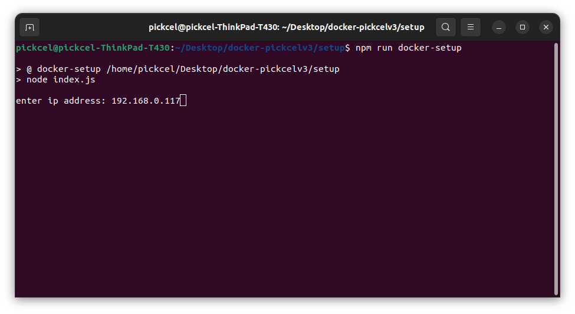
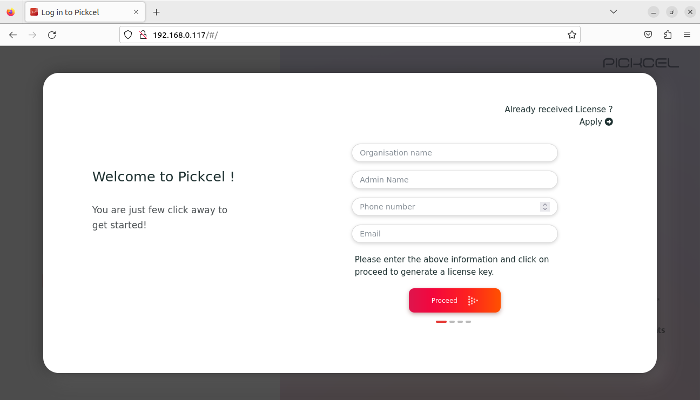
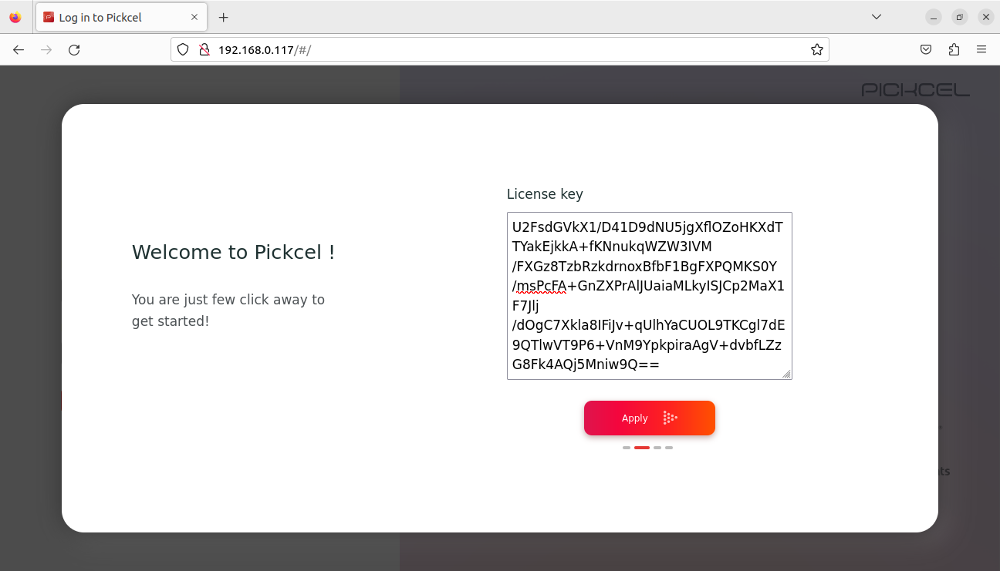
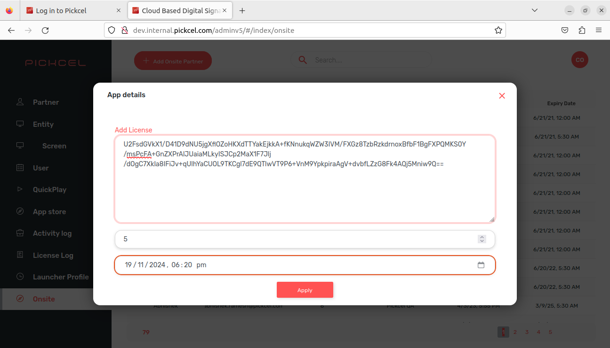
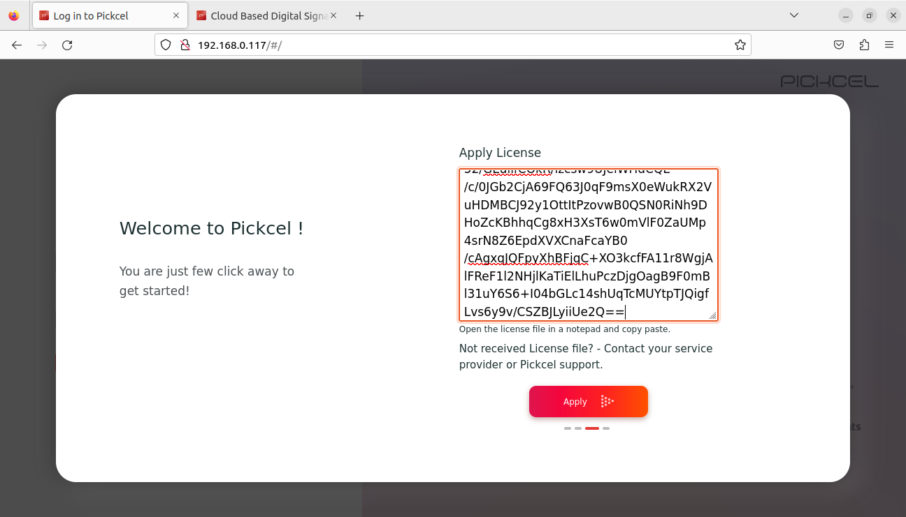
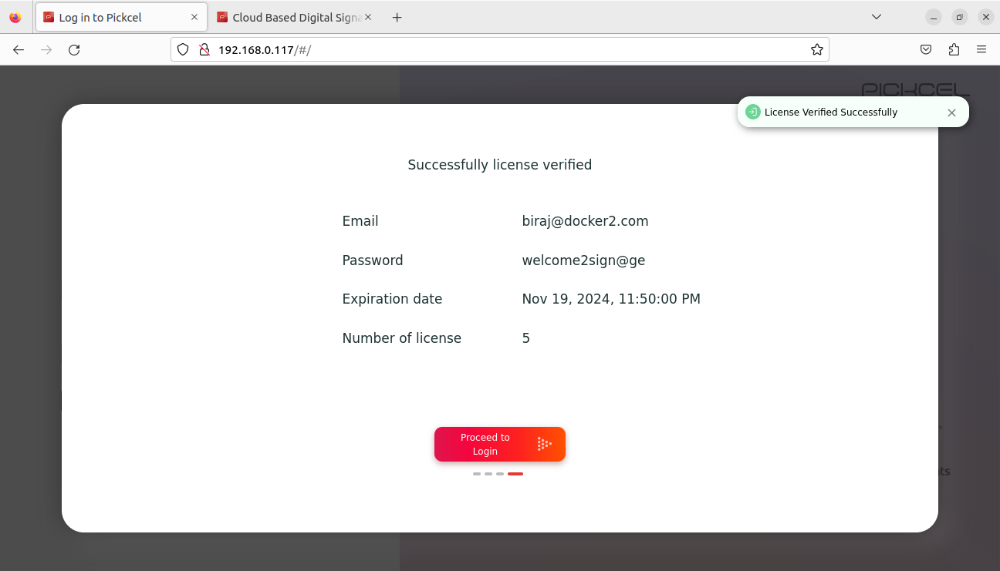

# Docker on-premise initial setup guide

1. You can do the setup now with a script, which has automated most of the post-installation steps required in docker setup!
2. Tested on Ubuntu 20.04.

## Steps:

- Install `curl` & `ifconfig`

  ```
  sudo apt-get install curl net-tools
  ```

- Make sure that Node.js & Docker are installed.

  ```
  node --version
  ```

  ```
  docker --version
  ```

  If they are installed, these commands would list the versions without any errors.

- To install node.js,

  1. Install [node version manager (nvm)](https://github.com/nvm-sh/nvm#installing-and-updating)
     ```
     curl -o- https://raw.githubusercontent.com/nvm-sh/nvm/v0.39.3/install.sh | bash
     ```
  2. Verify if `nvm` is properly installed or not using
     ```
     nvm --version
     ```
  3. Then install Node.js (version 18) using
     ```
     nvm install 18
     ```

- To install Docker, go to their [installation page](https://docs.docker.com/engine/install/#server), choose your operating system from the list & follow the instructions.

- If you installed Docker in the previous step, then you will have to wait for a minute or so before proceeding further for Docker socket to be running.

  To verify if Docker socket is running, execute the following command. If the socket is running, it won't throw any error.

  ```
  sudo docker images
  ```

- Run the `ifconfig` command & note down the required ip address. It will be required in a later step.

- Using `cd` command, navigate & go inside the _docker-pickcelv3_ folder.

- By this point, Node & Docker should be installed & ip address have been should be noted down. These are the prerequisites for the next step.

- Run the setup command.

  1. Go inside the _setup_ folder.

     ```
     cd ./setup
     ```

  2. Install the dependencies.

     ```
     npm install
     ```

  3. Run the setup command.
     ```
     npm run docker-setup
     ```

- The script will ask for ip address first. Type the ip address that you noted down & hit `Enter`
  
- Building the images for the first time would take quite a while.
- Once everything is completed succesfully, you'll see a **done!** message in the terminal at the end.
- Now open the browser, enter the ip address (the one that you noted down) & you should see the signage page.
- **Step 1 (client side):** Enter client's details & click _Proceed_. You should get a key (next step).

- **Step 2:** Copy that key from client's browser & head over to our [Admin Setup](http://dev.internal.pickcel.com/adminv5/). Do it on your system, not client's.

- Navigate to **Onsite** section from the side navbar.
- Click on _Add Onsite Partner_ button on the top left.
- There paste the client key & select number of screens & expiry date.

- Click **Apply** button & you'll get a license key. You'll have to enter this key on client's system.
- **Step 3**: So continuing from **Step 2**, click on _Apply_ button in & you'll be asked to paste the received key. Enter/paste the key that you generated from our Admin setup & click _Apply_

- You should see the client's details - email, password, number of screens assigned & expiry date.

- Now just client on _Proceed to login_ to login & you're good to go.